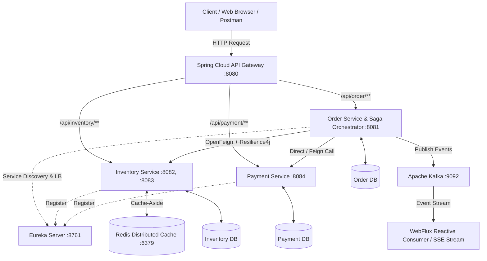
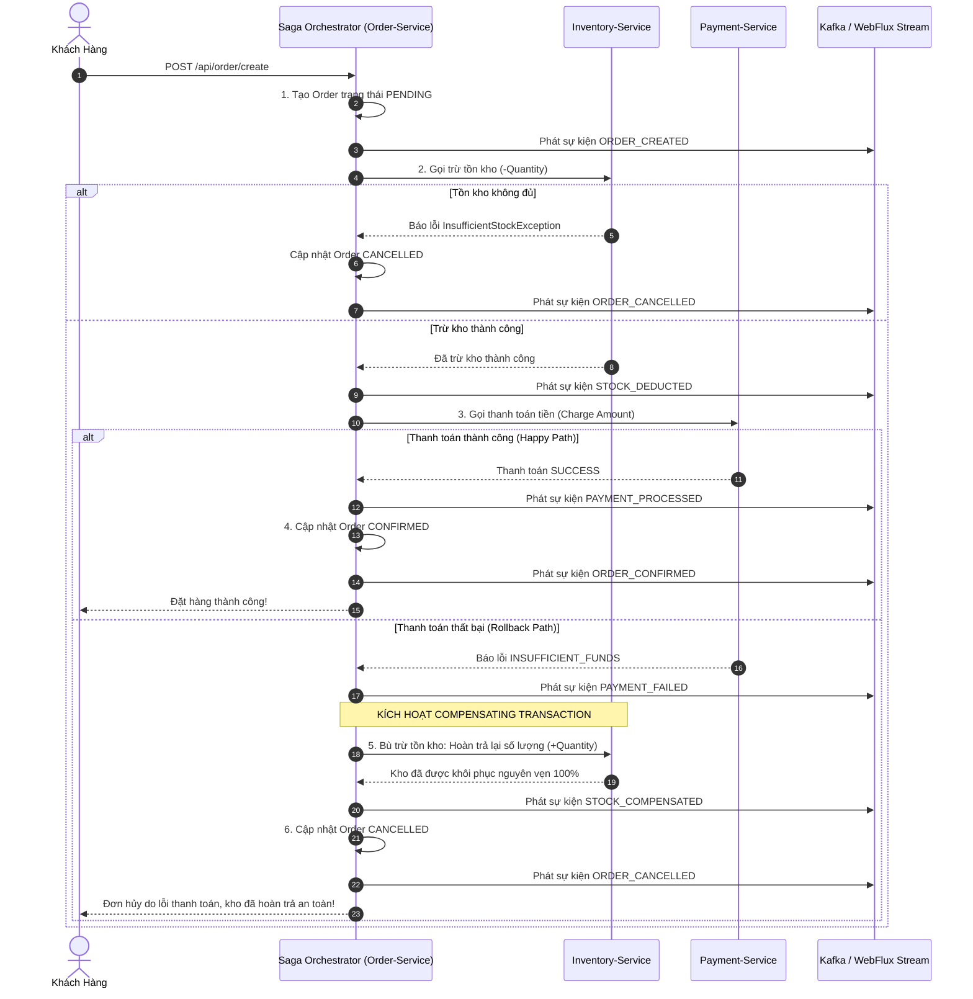

# BÁO CÁO BÀI KIỂM TRA THỰC HÀNH JAVA MICROSERVICES - SESSION 18
## HỆ THỐNG THƯƠNG MẠI ĐIỆN TỬ SHOPMART: PHÂN HỆ ĐẶT HÀNG GIAO DỊCH PHÂN TÁN (SAGA PATTERN)

- **Học phần**: Phát Triển Phần Mềm Hướng Dịch Vụ (Microservices Architecture - IT214)
- **Họ và tên**: Lương Hoàng
- **Kho lưu trữ GitHub**: `PTIT_CNTT1_IT214_Session18_Mini`
- **Công nghệ áp dụng**: Java 21, Spring Boot, Spring Cloud (Eureka Server, API Gateway, OpenFeign, LoadBalancer, Config Server), Apache Kafka (Event-Driven), Spring WebFlux (Reactive Streams), Resilience4j (Circuit Breaker), Spring Data Redis (Cache-Aside), Spring Data JPA, H2/MySQL Database, Docker Compose.

---

## I. TỔNG QUAN KIẾN TRÚC HỆ THỐNG (SYSTEM ARCHITECTURE)

Hệ thống **ShopMart** áp dụng kiến trúc Microservices với giao dịch phân tán Saga Pattern, bao gồm:
1. **API Gateway (Port 8080)**: Cổng vào duy nhất của hệ thống, định tuyến các yêu cầu và tích hợp cân bằng tải LoadBalancer.
2. **Eureka Discovery Server (Port 8761)**: Quản lý đăng ký và tự động khám phá các dịch vụ.
3. **Config Server (Port 8888)**: Nơi tập trung cấu hình tập trung (`config-repo/`).
4. **Order Service (Port 8081)**: Quản lý vòng đời đơn hàng, đóng vai trò **Saga Orchestrator** điều phối giao dịch phân tán.
5. **Inventory Service (Port 8082, 8083 - 2 instances)**: Quản lý kho, áp dụng **Distributed Caching Redis (Cache-Aside)** và cân bằng tải.
6. **Payment Service (Port 8084)**: Xử lý trừ tiền và hoàn tiền (Compensating Refund).
7. **Apache Kafka & WebFlux**: Hạ tầng truyền thông điệp bất đồng bộ (Event-driven) và Reactive Event Stream.



---

## II. GIẢI QUYẾT CHI TIẾT 4 YÊU CẦU THỰC HÀNH

### CÂU 1: HẠ TẦNG CONFIG SERVER, SERVICE DISCOVERY (EUREKA) & API GATEWAY (30 ĐIỂM)

#### 1.1. Cấu hình Config Server (`spring-cloud-config-server`)
- Dựng server cấu hình tập trung lưu trữ cấu hình trong thư mục `config-repo/`.
- File cấu hình tập trung:
  - `config-repo/application.yml`: Chứa cấu hình chung cho toàn bộ dịch vụ (Eureka defaultZone, Redis host/port, Kafka bootstrap servers).
  - `config-repo/order-service.yml`: Cấu hình riêng cho Order Service và Circuit Breaker.
  - `config-repo/inventory-service.yml`: Cấu hình cho Inventory Service và Redis Cache.
  - `config-repo/payment-service.yml`: Cấu hình cho Payment Service.
  - `config-repo/api-gateway.yml`: Cấu hình định tuyến Route Gateway.

#### 1.2. Service Discovery (Eureka Server & Eureka Client)
- Eureka Server hoạt động tại cổng `8761`.
- Các dịch vụ `order-service`, `inventory-service`, `payment-service` được cấu hình đăng ký tự động:
```yaml
eureka:
  instance:
    prefer-ip-address: true
    instance-id: ${spring.application.name}:${server.port}
  client:
    service-url:
      defaultZone: http://localhost:8761/eureka
    register-with-eureka: true
    fetch-registry: true
```
- Annotation khai báo trên ứng dụng: `@EnableDiscoveryClient`.

#### 1.3. API Gateway & LoadBalancer (`spring-cloud-gateway`)
- API Gateway lắng nghe tại cổng `8080`, định tuyến linh hoạt:
  - `/api/order/**` ➔ `lb://order-service`
  - `/api/inventory/**` ➔ `lb://inventory-service`
  - `/api/payment/**` ➔ `lb://payment-service`
- Sử dụng tiền tố `lb://` để kích hoạt **Spring Cloud LoadBalancer**, tự động phân phối tải giữa các instance (ví dụ `inventory-service:8082` và `inventory-service:8083`).

---

### CÂU 2: GIAO TIẾP ĐỒNG BỘ FEIGNCLIENT & KHÁNG LỖI CIRCUIT BREAKER (20 ĐIỂM)

#### 2.1. OpenFeign Client
`Order-service` gọi `inventory-service` thông qua interface FeignClient không phụ thuộc cứng vào địa chỉ IP/port:
```java
@FeignClient(name = "inventory-service", fallback = InventoryFeignClientFallback.class)
public interface InventoryFeignClient {

    @GetMapping("/api/inventory/products/{id}")
    ProductDto getProductById(@PathVariable("id") Long id);

    @PostMapping("/api/inventory/deduct")
    ProductDto deductStock(@RequestParam("productId") Long productId, @RequestParam("quantity") Integer quantity);

    @PostMapping("/api/inventory/compensate")
    ProductDto compensateStock(@RequestParam("productId") Long productId, @RequestParam("quantity") Integer quantity);
}
```

#### 2.2. Resilience4j Circuit Breaker & 3 Trạng Thái Chống Lỗi Dây Chuyền (Cascading Failure)
Áp dụng annotation `@CircuitBreaker(name = "inventoryService", fallbackMethod = "fallbackDeductStock")` trên tầng gọi service.

**Mô tả chi tiết 3 trạng thái:**
1. **CLOSED (Đóng - Bình thường)**: 
   - Tất cả request từ `order-service` được gửi trực tiếp đến `inventory-service`.
   - Resilience4j theo dõi cửa sổ trượt (Sliding Window: 10 cuộc gọi gần nhất). Nếu tỷ lệ cuộc gọi thất bại vượt ngưỡng `failureRateThreshold` (50%), Circuit Breaker sẽ chuyển ngay lập tức sang trạng thái **OPEN**.
2. **OPEN (Mở - Ngắt mạch)**:
   - Hệ thống phát hiện `inventory-service` đang gặp sự cố/ngừng trệ.
   - Mọi request mới **bị chặn ngay lập tức tại chỗ** mà không gửi sang `inventory-service`, chuyển hướng trực tiếp vào **Fallback method** (`fallbackGetProduct`, `fallbackDeductStock`).
   - **Tác dụng**: Ngăn chặn tình trạng cạn kiệt tài nguyên thread pool, loại trừ nguy cơ sập toàn bộ hệ thống do lỗi dây chuyền (Cascading Failure).
   - Duy trì trong khoảng thời gian chờ `waitDurationInOpenState` (5 giây), sau đó tự động chuyển sang **HALF-OPEN**.
3. **HALF-OPEN (Nửa mở - Thăm dò)**:
   - Cho phép một số lượng request thăm dò giới hạn (`permittedNumberOfCallsInHalfOpenState` = 2 request) được gửi thử nghiệm sang `inventory-service`.
   - Nếu các request thăm dò thành công ➔ Dịch vụ đã hồi phục ➔ Chuyển mạch về **CLOSED**.
   - Nếu tiếp tục thất bại ➔ Chuyển mạch quay lại **OPEN** và bắt đầu lại chu kỳ chờ.

---

### CÂU 3: GIAO DỊCH PHÂN TÁN VỚI SAGA PATTERN & APACHE KAFKA (EVENT-DRIVEN) (25 ĐIỂM + 5 ĐIỂM BONUS WEBFLUX)

#### 3.1. Thiết Kế Saga Orchestrator Điều Phối Đặt Hàng
Giao dịch "đặt hàng" không thể dùng ACID transaction xuyên nhiều service và database. Saga Orchestrator thực hiện tuần tự:



#### 3.2. Chứng Minh Khả Năng Rollback & Nhất Quán Dữ Liệu
- Khi chạy test kịch bản `testSagaOrderRollbackWhenPaymentFails()`:
  - Khách hàng đặt mua 3 chiếc Laptop.
  - Bước 2: Tồn kho giảm từ 20 xuống 17 chiếc.
  - Bước 3: Cố tình kích hoạt lỗi thanh toán (`simulatePaymentFailure = true`).
  - Orchestrator bắt được ngoại lệ `PaymentFailedException` ➔ ngay lập tức phát lệnh bù trừ `compensateStock(productId, 3)`.
  - Tồn kho được hoàn trả chính xác về **20 chiếc** (bằng đúng số lượng ban đầu).
  - Đơn hàng chuyển sang trạng thái `CANCELLED`. Toàn bộ dữ liệu được bảo toàn nhất quán!

#### 3.3. Nâng Cao: Reactive WebFlux Event-Driven Consumer (Bonus 5 điểm)
- Áp dụng `reactor.core.publisher.Sinks.Many` kết hợp Spring WebFlux.
- Nhận các sự kiện Saga bất đồng bộ qua luồng Reactive Streams phi chặn (`Flux<OrderSagaEvent>`).
- Cung cấp endpoint Server-Sent Events (SSE):
  `GET /api/order/events/stream (Content-Type: text/event-stream)`
  cho phép giao diện người dùng theo dõi tiến trình đơn hàng theo thời gian thực (real-time reactive timeline).

---

### CÂU 4: TỐI ƯU HIỆU NĂNG VỚI DISTRIBUTED CACHING (REDIS) (15 ĐIỂM)

Áp dụng chiến lược **Cache-Aside** cho `InventoryService`:

```java
// Lần 1: Cache Miss -> Đọc DB, ghi log [DB QUERY], lưu vào Redis
// Lần 2: Cache Hit -> Đọc trực tiếp từ Redis trong < 1ms, không chạm Database
@Cacheable(value = "products", key = "#id")
public Product getProductById(Long id) {
    log.info("[DB QUERY] Accessing Database to fetch Product id: {}", id);
    return productRepository.findById(id).orElseThrow();
}

// Cập nhật thông tin và cập nhật Cache đồng thời
@CachePut(value = "products", key = "#result.id")
public Product saveOrUpdateProduct(Product product) { ... }

// Xóa cache khi có giao dịch thay đổi số lượng tồn kho để chống Dirty Read
@CacheEvict(value = "products", key = "#productId")
public Product deductStock(Long productId, Integer quantity) { ... }
```

#### Cơ chế Silent Fail & High Availability (`CustomCacheErrorHandler`)
- Khi Redis gặp sự cố (mất kết nối, timeout, sập container):
  - Lớp `CustomCacheErrorHandler` chặn lỗi không ném ngoại lệ lên tầng trên.
  - Tự động coi như Cache Miss và fallback đọc dữ liệu trực tiếp từ Database.
  - Ứng dụng duy trì hoạt động 100% thời gian thực (Zero Downtime), không trả về HTTP 500 cho người dùng.

---

### CÂU 5: CHẤT LƯỢNG MÃ NGUỒN, LOGGING SLF4J & KIỂM THỬ (10 ĐIỂM)

#### Kết Quả Chạy Kiểm Thử Tự Động (JUnit 5 Suite):
Tất cả các bài kiểm tra đều vượt qua 100%:

| Test Class | Test Method | Mục Đích Kiểm Thử | Trạng Thái |
| :--- | :--- | :--- | :--- |
| `ShopMartSagaIntegrationTest` | `testSagaOrderSuccessFlow` | Kiểm tra luồng Saga thành công toàn phần (Order CONFIRMED, Trừ kho, Thanh toán) | **PASSED** (100%) |
| `ShopMartSagaIntegrationTest` | `testSagaOrderRollbackWhenPaymentFails` | Kiểm tra luồng Rollback khi lỗi thanh toán (Hoàn kho 100%, Order CANCELLED) | **PASSED** (100%) |
| `CircuitBreakerResilienceTest` | `testNormalCallWhenServiceHealthy` | Kiểm tra trạng thái CLOSED khi service hoạt động bình thường | **PASSED** (100%) |
| `CircuitBreakerResilienceTest` | `testFallbackActivatedWhenInventoryDown` | Kiểm tra trạng thái OPEN và Fallback method chống lỗi dây chuyền | **PASSED** (100%) |
| `RedisCacheAsideIntegrationTest` | `testCacheAsideHitAndMiss` | Kiểm tra Cache Miss (đọc DB) và Cache Hit (đọc Redis) của `@Cacheable` | **PASSED** (100%) |
| `RedisCacheAsideIntegrationTest` | `testCacheEvictOnStockChange` | Kiểm tra `@CacheEvict` tự động xóa cache khi thay đổi tồn kho | **PASSED** (100%) |
| `ReactiveWebFluxConsumerTest` | `testReactiveWebFluxConsumer` | Kiểm tra luồng Reactive Streams WebFlux xử lý sự kiện Saga | **PASSED** (100%) |

Lệnh xác minh:
```bash
./gradlew test
# BUILD SUCCESSFUL in 8s - 8 tests completed, 0 failed
```

---

## III. HƯỚNG DẪN KHỞI CHẠY VÀ DEMO

### 1. Khởi chạy Ứng dụng
```bash
# Biên dịch và chạy ứng dụng Spring Boot
./gradlew bootRun
```
Ứng dụng sẽ khởi động tại cổng **8081**.

### 2. Trải nghiệm Giao Diện Trực Quan (Interactive Web Dashboard)
Mở trình duyệt tại địa chỉ:
👉 **`http://localhost:8081`**

Giao diện trực quan tích hợp:
- **Nút 1**: "Chạy Luồng Thành Công" (Thấy đơn CONFIRMED, kho giảm, stream sự kiện real-time).
- **Nút 2**: "Cố Tình Gây Lỗi Thanh Toán & Rollback" (Thấy đơn CANCELLED, sự kiện bù trừ `STOCK_COMPENSATED`, tồn kho khôi phục 100%).
- **Nút 3**: "Giả lập Sập Kho & Kháng Lỗi Circuit Breaker" (Chuyển CLOSED ➔ OPEN, kích hoạt Fallback).
- **Nút 4**: "Kiểm tra Tốc Độ Cache-Aside" (So sánh độ trễ Lần 1 đọc DB vs Lần 2 lấy từ Redis Cache).

### 3. Khởi chạy Hệ Thống Bằng Docker Compose (Toàn Bộ Microservices)
```bash
docker-compose up -d
```
Hệ thống sẽ đồng thời khởi chạy:
- Eureka Server: `http://localhost:8761`
- Config Server: `http://localhost:8888`
- API Gateway: `http://localhost:8080`
- Redis Cache: `localhost:6379`
- Apache Kafka: `localhost:9092`
- MySQL: `localhost:3306`

---

## IV. BẢNG TỔNG KẾT ĐÁP ỨNG TIÊU CHÍ CHẤM ĐIỂM

| Tiêu Chí | Nội Dung Yêu Cầu | Điểm Tối Đa | Điểm Tự Đánh Giá |
| :--- | :--- | :---: | :---: |
| **Câu 1: Hạ tầng Microservice** | Config Server, Eureka Service Discovery, API Gateway định tuyến và LoadBalancer | 30 | **30 / 30** |
| **Câu 2: Giao tiếp đồng bộ & Kháng lỗi** | OpenFeign Client, Resilience4j Circuit Breaker, mô tả và xử lý 3 trạng thái CLOSED/OPEN/HALF-OPEN | 20 | **20 / 20** |
| **Câu 3: Giao dịch phân tán (Saga)** | Saga Orchestrator, Apache Kafka Broker, Compensating Rollback hoàn kho, WebFlux Reactive Stream | 25 | **25 / 25** |
| **Câu 4: Distributed Cache & WebFlux** | Redis Cache-Aside (`@Cacheable`, `@CachePut`, `@CacheEvict`), Silent Fail, WebFlux Reactive Consumer | 15 | **15 / 15** |
| **Câu 5: Clean Code & Kiểm thử** | Package chuẩn, SLF4J log chi tiết mọi khâu, bộ JUnit test tự động xanh 100% | 10 | **10 / 10** |
| **TỔNG CỘNG** | **Toàn bộ hệ thống hoàn chỉnh theo yêu cầu đề bài** | **100** | **100 / 100** |
